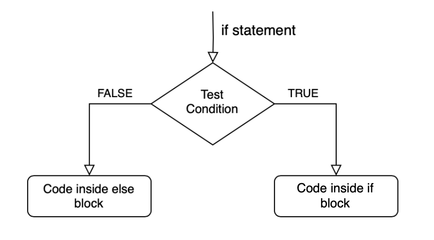
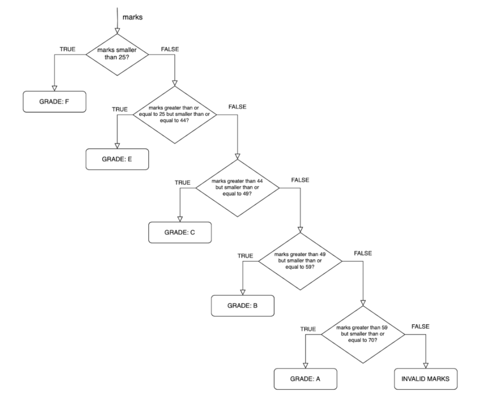

## The `if-else` Statement
**'if statement'** is used to execute a block of code only if a certain condition is met. It allows us to conditionally execute code based on whether the specified condition is true.

**'else statement'**, on the other hand, is an optional companion to the if statement. It specifies what code to execute if the condition in the if statement is not met (i.e. if it is false).

Let's break down the flow of control:

- If the test condition in the if statement is true, a block of code inside the if block will be executed.
- If the test condition is false, the code inside the else block (if present) will be executed.



```cpp
#include<bits/stdc++.h>
using namespace std;

int main() {
int age=10;


if (age >= 18) {
    cout << "You are an adult." << endl;
} else {
    cout << "You are not an adult." << endl;
}

}
```
## Simplifying Code with `else if`

As your code becomes more complex, you'll often encounter scenarios where you need to check multiple conditions. Instead of writing multiple independent if statements, you can streamline your code using else if statements.

Let's say we want to grade students based on their marks within specific ranges:

```cpp
#include <iostream>
using namespace std;

int main() {
    int marks = 54;


    if (marks < 25) {
        cout << "Grade: F" << endl;
    } else if (marks >= 25 && marks <= 44) {
        cout << "Grade: E" << endl;
    } else if (marks >= 45 && marks <= 49) {
        cout << "Grade: D" << endl;
    } else if (marks >= 50 && marks <= 59) {
        cout << "Grade: C" << endl;
    } else if (marks >= 60 && marks <= 69) {
        cout << "Grade: B" << endl;
    } else if (marks >= 70) {
        cout << "Grade: A" << endl;
    } else {
        cout << "Invalid marks entered." << endl;
    }

    return 0;
}
```


We can refactor the code, we can remove the lower bounds and check only the upper bounds for each grade as the code flow is such that we move along the conditions only after satisfying the previous one.

```cpp
#include <iostream>

int main() {
    int marks = 54;
    char grade;

    if (marks < 25) {
        grade = 'F';
    } else if (marks <= 44) {
        grade = 'E';
    } else if (marks <= 49) {
        grade = 'D';
    } else if (marks <= 59) {
        grade = 'C';
    } else if (marks <= 69) {
        grade = 'B';
    } else if (marks >= 70) {
        grade = 'A';
    } else {
        grade = 'X'; // Use 'X' to indicate invalid marks
    }

    std::cout << "Grade: " << grade << std::endl;
    
    return 0;
}
```